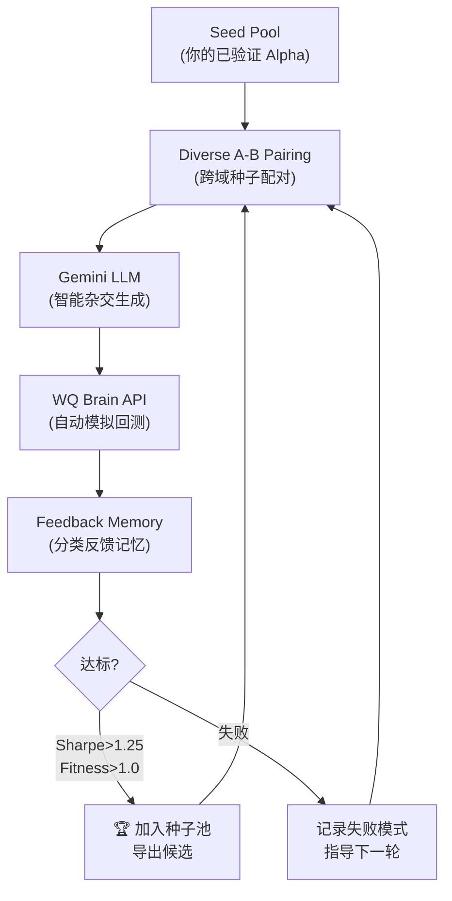

# 🧬 Alpha Mining Agent — 使用指南

## 架构概览



## 文件结构

```text
Evolutionary-Alpha-Miner/
├── .env                          ← Gemini API Key
├── credentials.json              ← WQ Brain 账号密码
├── run_agent.py                  ← 入口脚本
├── alpha_agent/
│   ├── agent.py                  ← 主编排器
│   ├── wq_client.py              ← WQ Brain API 客户端
│   ├── llm_hybridizer.py         ← Gemini LLM 杂交器
│   ├── seed_pool.py              ← 种子池管理 (含你的经验记录)
│   └── feedback_memory.py        ← 反馈记忆系统
└── data/                         ← 运行结果输出目录
    ├── seed_pool.json            ← 持久化种子库
    ├── feedback_memory.json      ← 持久化反馈记忆
    └── round_*.csv               ← 每轮结果 CSV
```

## 运行命令

### 1️⃣ Dry Run — 测试全流程 (不调用 WQ Brain)

```bash
cd /Users/wangshiwen/Desktop/workspace/worldquant/Evolutionary-Alpha-Miner
python run_agent.py --dry-run --rounds 1 --pairs-per-round 2 --modes-per-pair 2 -v
```

> [!TIP]
> 第一次运行建议用 `--dry-run`，验证 Gemini API 连接正常、种子配对正确。

### 2️⃣ 正式运行 — 全自动挖掘

```bash
python run_agent.py --rounds 2 --pairs-per-round 4 --modes-per-pair 2 -v
```

这会：
- 从你的 11 个已验证种子中采样 4 对跨域 A-B 父代
- 每对用 2 种变异模式调用 Gemini 生成候选
- 自动提交到 WQ Brain 模拟并等待结果
- 记录所有反馈，好的候选自动加入种子池

### 3️⃣ 大规模挖掘

```bash
python run_agent.py --rounds 5 --pairs-per-round 6 --modes-per-pair 3 -v
```

> [!WARNING]
> 每个候选需要 WQ Brain 模拟约 1-3 分钟。`6 pairs × 3 modes × 5 rounds = 90 候选`，预计耗时 2-4 小时。

## 参数说明

| 参数 | 默认值 | 说明 |
|------|--------|------|
| `--rounds` | 2 | 进化轮数 |
| `--pairs-per-round` | 4 | 每轮采样的 A-B 父代对数 |
| `--modes-per-pair` | 2 | 每对使用的变异模式数 |
| `--credentials` | `credentials.json` | WQ Brain 凭证文件 |
| `--gemini-model` | `gemini-2.5-flash` | Gemini 模型 |
| `--dry-run` | off | 不调用 WQ Brain |
| `-v` | off | 详细日志 |

## 5 种变异模式

| 模式 | 说明 | 示例 |
|------|------|------|
| `mild_corr_breaker` | B 作为弱调节因子打破相关性 | `group_neutralize(A * (1 + 0.1 * rank(B)), sector)` |
| `yield_plus_improvement` | 估值 + 改善组合 | `group_rank(ts_rank(A, 252) + 0.5 * rank(B), subindustry)` |
| `weak_gate_hybrid` | B 作为弱门控 | `trade_when(rank(B) > 0.55, A, -1)` |
| `regime_hybrid` | B 作为体制条件 | `if_else(ts_rank(B, 20) > 0.5, A, 0.5 * A)` |
| `conditional_activation` | B 满足条件时才激活 A | `if_else(ts_delta(B, 126) > 0, group_rank(A, subindustry), 0)` |

## 反馈分类 (Buckets)

| Bucket | 含义 | 后续处理 |
|--------|------|---------|
| `landed` | Sharpe ≥ 1.25 且 Fitness ≥ 1.0 | ✅ 自动加入种子池 |
| `strong_not_landed` | 通过但未达标 | 🌱 加入种子池继续优化 |
| `self_corr_trap` | 与已有 Alpha 高相关 | ⚠️ 记入黑名单，LLM 会避开 |
| `high_turnover` | 换手率过高 | 后续优先加 decay |
| `low_sharpe` / `low_fitness` | 信号太弱 | 记录失败模式 |

## 输出文件

每轮运行后在 `data/` 目录生成：
- `round_001_20260514_140500.csv` — 该轮所有候选结果
- `seed_pool.json` — 更新后的种子库
- `feedback_memory.json` — 累积反馈记忆

> [!NOTE]
> 反馈记忆是跨轮次持久化的。下次运行时 LLM 会参考历史失败/成功模式来指导生成。
